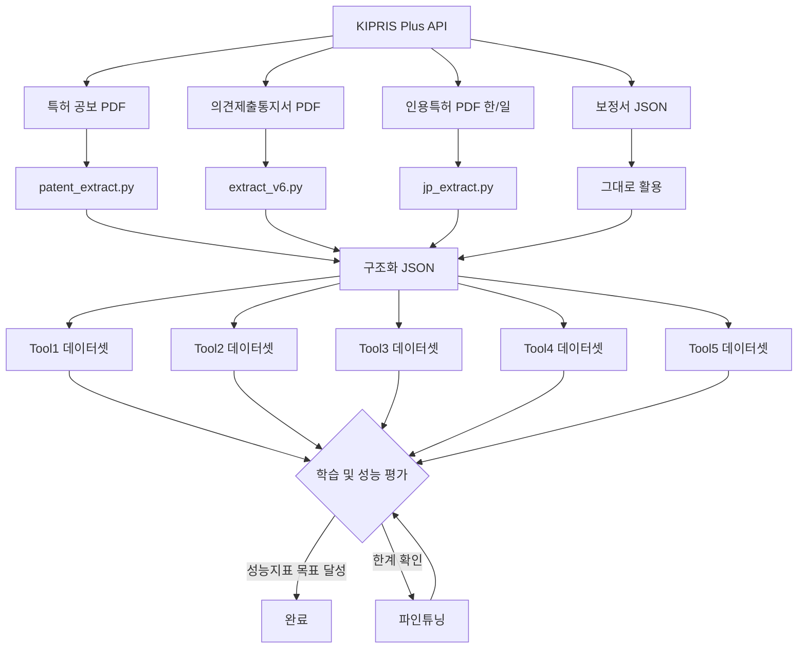

# tool 학습용 데이터셋 구축 프로젝트


KIPRIS Plus API로 특허 데이터를 수집하고, PDF를 파싱해 구조화된 JSON을 만든 뒤,
각 tool1,2,3,4,5의 llm 의 학습/평가 데이터셋을 구축하는 프로젝트.

---

## Table of Contents

- [전체 파이프라인](#전체-파이프라인)
- [디렉토리 구조](#디렉토리-구조)
- [설치 및 실행](#설치-및-실행)
- [파싱 모듈](#파싱-모듈)
- [툴 현황](#툴-현황)
- [협업 가이드](#협업-가이드)

---

## 협업 가이드

자세한 내용은 [CONTRIBUTING.md](docs/CONTRIBUTING.md)를 참고

## 전체 파이프라인



---

## 디렉토리 구조

```
.
├── patent_parsing/       특허 공보 PDF 파싱
│   └── patent_extract.py
├── OA_parsing/           의견제출통지서 PDF 파싱
│   └── extract_v6.py
├── JP_Cited_Patents/     일본 인용특허 PDF 파싱
│   └── jp_extract.py
├── AMD_parsing/          보정서 파싱
│   └── amd_extract.py
├── Figure_parsing/       도면 파싱
│   └── figure_extract.py
├── kipris/               KIPRIS API 데이터 수집
├── sa2_tool1.py          Tool1 구현체 (거절이유 분석)
├── sa2_tool2.py          Tool2 구현체 (청구항 파싱)
├── docs/                 툴별 데이터셋 기획 문서
└── _archive/             사용 종료 파일 보관
```

---

## 설치 및 실행

**사전 요구사항:** [uv](https://docs.astral.sh/uv/) 설치

```bash
git clone <repo-url>
cd 디렉토리명

# 의존성 설치
uv sync

# 환경변수 설정
cp .env.example .env
# .env 파일에 OPENROUTER_API_KEY 입력
# 만약 구현에 필요하면 key는 공유할 예정
```

---

## 툴 데이터셋 구성 가이드 문서(클릭해서 해당 md 문서로)

| 툴 | 기능 | 평가 방식 | 문서 |
|---|---|---|---|
| Tool1 | 거절이유 분석 | 자동 (F1, Accuracy, LLM judge) | [📄 개요](docs/tool1데이터셋개요.md) |
| Tool2 | 청구항 파싱 | 자동 (F1, LLM judge) | [📄 개요](docs/tool2데이터셋개요.md) |
| Tool3 | 클레임 차트 (O/X) | 자동 (O/X 분류) | [📄 개요](docs/tool3데이터셋개요.md) |
| Tool4 | 차이점·대응전략 | 사람 검수 필요 | [📄 개요](docs/tool4데이터셋개요.md) |
| Tool5 | 보정안 생성 | 사람 검수 필요 | [📄 개요](docs/tool5데이터셋개요.md) |

성능 개선 전략: **Phase 1** 프롬프팅 → 한계 확인 시 **Phase 2** LoRA 파인튜닝
